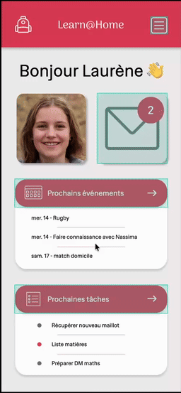

# OpenClassrooms – Project 10 Learn@Home

## 📌 Description

Source code of **Project 10 – Learn@Home**, completed as part of the **OpenClassrooms JavaScript React Developer path**.

This project focused on **defining the front-end design** for an educational support platform connecting students with volunteer tutors.
The main goals were to **understand user needs, model a technical solution, and design a functional interface** before development.

The association **Learn@Home** connects children facing academic difficulties with volunteer tutors.
Each student is assigned a volunteer tutor who supports them through short weekly sessions, helping them with homework and organisation. The goal of this project was to create a clear and functional design for a platform to facilitate communication and interactions between students and tutors.

Planned pages:

* Login page
* Dashboard
* Chat interface
* Calendar
* Task management page

⚠️ **Educational project**: This repository was created for learning purposes during my training. It is **not intended for production use**.

---

## 🎯 Learning Objectives

* Analyse user requirements and define functional specifications
* Model a technical solution with diagrams and user stories
* Design clear and user-friendly **mockups**
* Apply **agile methodology** using a Kanban board
* Communicate design concepts effectively to stakeholders

---

## 📦 Deliverables & Project Structure

* **[User Stories](./docs/UserStories.pdf)**: expected user interactions and acceptance criteria
* **[Use case diagrams](./docs/UseCases.pdf)**: visualise core functionalities and data flow
* **[UX/UI mockups](./docs/Mockups.pdf)**: desktop and mobile visual design guidance (created with **Penpot**)
* **[Kanban board](https://github.com/users/sedomu/projects/3)**: tasks linked to User Stories for project tracking
  Columns: **Backlog → Ready → In Progress → In Review → Done**

---

## 🛠 Tools & Methodologies

* **Penpot** for UX/UI mockups (open-source alternative to Figma)
* Agile methodology with Kanban workflow
* User Stories & acceptance criteria
* Use case diagrams for technical modeling

---

## 📺 Prototyping

The following interactive prototypes were created with Penpot and exported as GIFs.  
They provide a self-contained preview of the design without requiring access to Penpot.

| Login                      | Conversation                             | Calendar and Tasks                               |
|----------------------------|------------------------------------------|--------------------------------------------------|
|  |  |  |

---

## ⚠️ Disclaimer

This is a **training project** created as part of the OpenClassrooms curriculum.
It is not a functional application but a **design and project planning exercise** intended for learning UX/UI, requirements analysis, and agile project organisation.